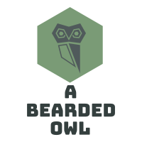

[![Forks][forks-shield]][forks-url]
[![Stargazers][stars-shield]][stars-url]
[![Issues][issues-shield]][issues-url]
[![LinkedIn][linkedin-shield]][linkedin-url]


<!-- PROJECT LOGO -->
<br />
<p align="center">
  <a href="https://github.com/jhyoung09/BUMS/">
    
  </a>

  <h3 align="center">BUMS</h3>

  <p align="center">
    Back Up My Shtuff
    <br />
    <a href="https://github.com/jhyoung09/BUMS/"><strong>Explore the docs »</strong></a>
    <br />
    <br />
    <a href="https://github.com/jhyoung09/BUMS/">View Demo</a>
    ·
    <a href="https://github.com/jhyoung09/BUMS/issues">Report Bug</a>
    ·
    <a href="https://github.com/jhyoung09/BUMS/issues">Request Feature</a>
    ·
    <a href="https://github.com/jhyoung09/BUMS/pulls">Send a Pull Request</a>
  </p>
</p>


<!-- TABLE OF CONTENTS -->
## Table of Contents

- [Table of Contents](#table-of-contents)
- [About The Project](#about-the-project)
  - [Built With](#built-with)
- [Getting Started](#getting-started)
  - [Prerequisites](#prerequisites)
- [Roadmap](#roadmap)
- [Contributing](#contributing)
- [License](#license)
- [Contact](#contact)
- [Acknowledgements](#acknowledgements)


<!-- ABOUT THE PROJECT -->
## About The Project

[![Product Name Screen Shot][product-screenshot]](https://example.com)

This project is to create a Python program that will gather input and options from the End User, and then based on those options sync files between two folder locations.

The options to gather from the End User will be:
* How to present the data
* If the End User wants a report generated, and what format to generate that report in (print to screen, or .txt)
* Input the folders the End User wants to sync between
* Add those folders to a CONFIG file for easy selection next time
* Choose if you want to PUSH from 1 folder to the next, PULL from 1 folder to the next, or do both
* Write a log of all the actions performed


### Built With
This section should list any major frameworks that you built your project using. Leave any add-ons/plugins for the acknowledgements section. Here are a few examples.
* [Python 3.8.1](https://python.org)


<!-- GETTING STARTED -->
## Getting Started
To get a local copy up and running follow these simple example steps.

### Prerequisites

I'm building this with a few various libraries. I've frozen them from my VENV and you can easily install them with the below instructions.
* clone repo
```
git clone https://github.com/jhyoung09/BUMS.git
```
* requirements
```
pip install -r requirements.txt
```


<!-- USAGE EXAMPLES -->


<!-- ROADMAP -->
## Roadmap

See the [open issues](https://github.com/jhyoung09/BUMS/issues) for a list of proposed features (and known issues).


<!-- CONTRIBUTING -->
## Contributing

Contributions are what make the open source community such an amazing place to be learn, inspire, and create. Any contributions you make are **extremely appreciated**.

1. Fork the Project
2. Create your Feature Branch (`git checkout -b feature/AmazingFeature`)
3. Commit your Changes (`git commit -m 'Add some AmazingFeature'`)
4. Push to the Branch (`git push origin feature/AmazingFeature`)
5. Open a Pull Request


<!-- LICENSE -->
## License
Describe your License for your project. 

Distributed under the MIT License. See `LICENSE` for more information.


<!-- CONTACT -->
## Contact

James Hunter Young - hnter@youngs.us

Project Link: [https://github.com/jhyoung09/BUMS](https://github.com/jhyoung09/BUMS)


<!-- ACKNOWLEDGEMENTS -->
## Acknowledgements
* [Img Shields](https://shields.io)
* [GitHub Pages](https://pages.github.com)
* [Font Awesome](https://fontawesome.com)
* [Roshan Lamichhane](https://github.com/roshanlam/ReadMeTemplate), for his awesome readme template


<!-- MARKDOWN LINKS & IMAGES -->
<!-- https://www.markdownguide.org/basic-syntax/#reference-style-links -->
[forks-shield]: https://img.shields.io/github/forks/jhyoung09/BUMS?style=flat-square
[forks-url]: https://github.com/jhyoung09/BUMS/network/members
[stars-shield]: https://img.shields.io/github/stars/jhyoung09/BUMS?style=flat-square
[stars-url]: https://github.com/jhyoung09/BUMS/stargazers
[issues-shield]: https://img.shields.io/github/issues/jhyoung09/BUMS?style=flat-square
[issues-url]: https://github.com/jhyoung09/BUMS/issues
[linkedin-shield]: https://img.shields.io/badge/-LinkedIn-black.svg?style=flat-square&logo=linkedin&colorB=555
[linkedin-url]: https://www.linkedin.com/in/jameshunteryoung/p
